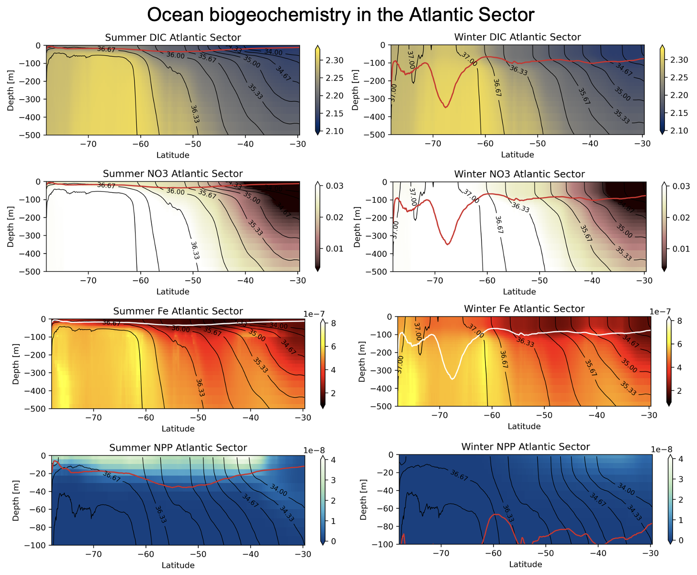

# FRONtal Transport of Tracers in the Southern Ocean (FRONT)

This project explores the complexity of mixing processes in the biogeochemistry of the Southern Ocean using the [B-SOSE](https://sose.ucsd.edu/) product of t
he [NASA ECCO](https://ecco-group.org/home.htm) Consortium. It has been created as part of the [ECCO Summer School 2025](https://ecco-summer-school.github.io/ecco-2025/).

## Collaborators

* [Anna Lo Piccolo](https://github.com/annlopiccolo)

## Motivation

Ocean mixing is important for the transport of tracers. At frontal regions the outcropping isopycnals enhance the vertical motion of tracers. Also, it has been found that small-scale instabilities associated to upper ocean fronts - such as the submesoscale - affect the ocean biogeochemistry (Lévy et al., 2018). The Southern Ocean is a highly energetic region with strong submesoscale activity and it plays an important role in the global ocean carbon uptake. Understanding the role of mixing processes in the ocean biogeochemistry is the goal of this project.   

## Data and Methods

The monthly output data from [B-SOSE](https://sose.ucsd.edu/) 156 iteration at 1/6 degree has been downloaded and analyzed. The Atlantic sector from lon 300 to 360 has been selected to analyze the meridional distribution of tracers' concentration. Tracers analyzed are:

* Dissolved Inorganic Carbon (DIC)
* Nitrate (NO3)
* Iron (Fe)
* Net Primary Productivity (NPP)

The climatology has been studied distinguishing summer (JJA) and winter (DJF).

## Project goals

* Is there a seasonality in the biogeochemistry of the upper Southern Ocean?
* What is the meridional distribution in the biogeochemistry of the upper Southern Ocean?
* What is the role of ocean mixing in the transport of tracers?

## Tasks

* Task 1: be familiar with B-SOSE output data: variables and grid structure
* Task 2: be familiar with assessing and downloading the data (using tmux and wget)
* Task 3: learn how to deal with lots of data
* Task 4: be familiar with GitHub and jupyter notebooks
* Task 5: be familiar with climatology, seasonality, and interannual variability of the biogeochemistry of the Southern Ocean

## Project Results

In the Southern Ocean:

* more carbon at higher latitudes
* mixed-layer depth deeper where strongest fronts are located

In the Atlantic sector:

* less carbon in summer: biology more active in summer
* more carbon in winter: less biology and more mixing
* nitrate and iron are upwelled in winter due to outcropping isopycnals
* deep mixed-layer in the Weddell Sea in winter: deep ocean ventilation
* mixed-layer depth interannual variability peaks from 2019 to 2021

